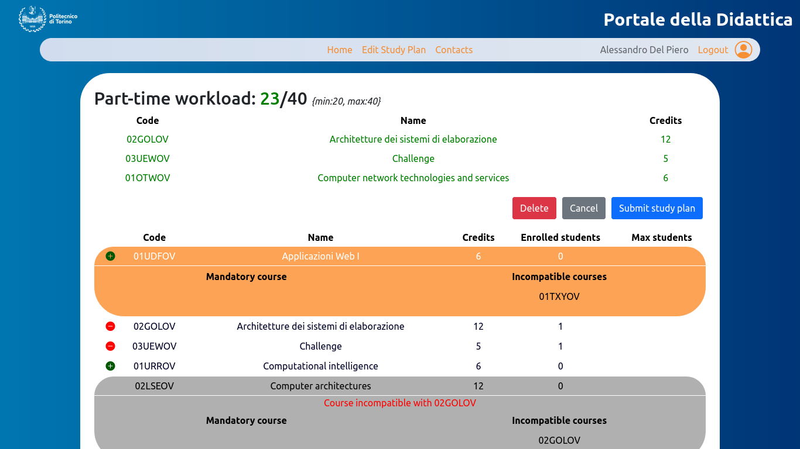

# Exam #1: "Study Plan"
## Student: s305950 FANULI GIUSEPPE 

## React Client Application Routes

- Route `/`:
  - Navbar component that contains a list of buttons
    - "Home" button that allow to navigate to the current home directory (`/`)
    - "Login" button that navigate to `/login` page
  
  - Course table with all courses offered

- Route `/user/:userID`: 
  - Navbar component that contains a list of buttons
      - "Home" button that allow to navigate to the curren home directory (`/user/:userID`)
      - "Create Study Plan" button to navigate to `/user/:userID/add` if no study plan is available for the current user
      - "Edit Study Plan" button to navigate to `/user/:userID/edit` if a study plan is available for the current user
      - "Logout" button that perform logout
  
  - Study Plan if the study plan is available for that user
  - Course table with all courses offered
  - `:userID` define which user is logged-in

- Route `/user/:userID/add`:
  - Navbar component with the same functionalities of logged-in root Route
  - Checkbox component to define the workload
  - Course table with all courses available
    - "Plus" button to add the curse to the study plan
    - "Remove" button to remove the course from the study plan
  - Current study plan of the current user
  - "Cancel" button to cancel all operations and return to the logged-in root page
  - "Delete" button to delete the current study plan and return to the logged-in root page
  - "Submit Study Plan" button to submit the study plan and return to the logge-in root page

- Route `/user/:userID/edit`:
  - Navbar component with the same functionalities of logged-in root Route
  - Course table with all courses available
    - "Plus" button to add the curse to the study plan
    - "Remove" button to remove the course from the study plan
  - Current study plan of the current user
  - "Cancel" button to cancel all operations and return to the logged-in root page
  - "Delete" button to delete the current study plan and return to the logged-in root page
  - "Submit Study Plan" button to submit the study plan and return to the logge-in root page

- Route `/login`:
 - "Cancel" button to cancel the operation and to go back to not-logged-in route
 - "Login" butto to perform login

## API Server

**POST `/api/v1/login`**
- **User login**
- **Request header**: 
```
{
  'Content-Type': 'application/json',
}
```
- **Request params**: none
- **Request body**: 
```
  {
    username: mario@studenti.polito.it
    password: password
  }
```
- **Response body**: 201 CREATED
```
  {
    id: 1,
    username: testuser@studenti.polito.it,
    name: Mario,
    surname: Rossi
  }
```

- **DELETE `/api/v1/logout`**:
  - **User logout**
  - **Request header**: none
  - **Request params**: none
  - **Request body**: none
  - **Response body**: 200 OK

- **GET `/api/v1/userInfo`**:
  - **Get user info for the current user**
  - **Request header**: none
  - **Request params**: none
  - **Request body**: 200 OK
  - **Response body**:
```
  {
    id: 1,
    username: mario@studenti.polito.it,
    name: Mario,
    surname: Rossi
  }
```

- **GET `/api/v1/courses`**:
  - **Get all courses**
  - **Request header**: none
  - **Request params**: none
  - **Request body**: none
  - **Response body**: 200 OK, 500 INTERNAL SERVER ERROR
```
[
  {
    "code":"01UDFOV",
    "name":"Applicazioni Web I",
    "credits":6,
    "enrolledStudents":0,
    "maxStudents":null,
    "preparatoryCourse":null,
    "incompatibleCourses":["01TXYOV"]
  },
  {
    "code":"02GOLOV",
    "name":"Architetture dei sistemi di elaborazione",
    "credits":12,
    "enrolledStudents":0,
    "maxStudents":null,
    "preparatoryCourse":null,
    "incompatibleCourses":["02LSEOV"]
  },
  ...
]
```


- **GET `/api/v1/courses/studyplan`**:
  - **Get study plan for the current user**
  - **Request header**: none
  - **Request params**: none
  - **Request body**: none
  - **Response body**: 200 OK, 500 INTERNAL SERVER ERROR
```
  [
    {
      "code":"01SQOOV",
      "name":"Reti Locali e Data Center",
      "credits":6,
      "enrolledStudents":1,
      "maxStudents":null,
      "preparatoryCourse":null,
      "studentID":1,
      "courseID":"01SQOOV"
    },
    {
      "code":"04GSPOV",
      "name":"Software engineering",
      "credits":6,
      "enrolledStudents":1,
      "maxStudents":null,
      "preparatoryCourse":"02LSEOV",
      "studentID":1,
      "courseID":"04GSPOV"
    },
    ...
]
```

- **POST `/api/v1/courses/studyplan`**:
  - **Store study plan of the current user**
  - **Request header**:
```
{
  'Content-Type': 'application/json',
}
```
  - **Request params**: none
  - **Request body**:
```
  {
    "studyPlan":[
      {
        "code":"01UDFOV",
        "name":"Applicazioni Web I",
        "credits":6,
        "enrolledStudents":0,
        "maxStudents":null,
        "preparatoryCourse":null,
        "incompatibleCourses":["01TXYOV"]
      },
      {
        "code":"02GOLOV",
        "name":"Architetture dei sistemi di elaborazione",
        "credits":12,
        "enrolledStudents":0,
        "maxStudents":null,
        "preparatoryCourse":null,
        "incompatibleCourses":["02LSEOV"]
      },
      ...
    ],
    "workload":"part-time"
  }
```
  - **Response body**: 201 CREATED, 422 UNPROCESSABLE ENTITY, 404 NOT FOUND, 500 INTERNAL SERVER ERROR

- **DELETE `/api/v1/courses/studyplan`**:
  - **Delete study plan of the current user**
  - **Request header**: none
  - **Request params**: none
  - **Request body**: none
  - **Response body**: 204 NO CONTENT, 503 SERVICE UNAVAILABLE

- **GET `/api/v1/studentInfo`**:
  - **Get student info of the current user**
  - **Request header**: none
  - **Request params**: none
  - **Request body**: none
  - **Response body**: 200 OK, 500 INTERNAL SERVER ERROR
```
  {
    studentID: 1,
    name: "Mario"
    surname: "Rossi",
    workload: "part-time"
  }
```

## Database Tables

- Table `COURSE` 
  - code
  - name
  - credits
  - enrolledStudents
  - maxStudents
  - preparatoryCourse
- Table `ENROLLED_STUDENTS`
  - studentID
  - courseID
- Table `INCOMPATIBLE_COURSES`
  - courseCode
  - incompatibleCode
- Table `STUDENT`
  - studentID
  - name
  - surname
  - workload
- Table `USER`
  - email
  - hash
  - salt
  - studentID


## Main React Components

- `LoginRoute` (in `Authentication.js`):
  - *Handle login form*
- `EditStudyPlan` (in `EditStudyPlan.js`):
  - *It shows course table and study plan table of the current user and handle the editing of the study plan*
- `SetWorkload` (in `EditStudyPlan.js`):
  - *It allows to set the student workload if not present*

- `Layout` (in `Layout.js`):
  - *Base layout for the web app*

- `LoggedInView` (in `LoggedInView.js`):
  - *It shows the page content for a logged-in user*

- `NotLoggedInView` (in `NotLoggedInView.js`):
  - *It shows the page content for a non-authenticated user*

- `Navbar` (in `Navbar.js`):
  - *It contains the main actions to navigate through pages*

- `StudyPlanTable` (in `StudyPlanTable.js`):
  - *The table in which the courses are presented*

- `TableRow` (in `StudyPlanTable.js`):
  - *The component in which course attributes are shown*

- `HiddenTable` (in `StudyPlanTable.js`):
  - *The table that contains course info. It will be shown when a `TableRow` row will be clicked*

## Screenshot



## Users Credentials

- giuseppe@studenti.polito.it, password
- mario@studenti.polito.it, password
- luca@studenti.polito.it, password
- delpiero@studenti.polito.it, password
- totti@studenti.polito.it, password
